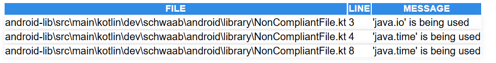

KMP-Verifier
----

Gradle Plugin that can be applied to Android projects to identify
code that is incompatible with Kotlin Multiplatform Mobile, aiming to
facilitate the understanding of what adaptations are needed when coming
from an Android-exclusive project.

## Usage

> **Note**: This plugin is not published anywhere, and there are no plans to do it.
>           This is just an exploration project.

1. Configure `build.gradle.kts`
```kotlin
plugins {
    id("dev.schwaab.kmpverifier")
}

kmpVerifier {
    reportFormat.set(ReportFormat.HTML)             // Defaults to HTML
    outputDirectory.set(file("build/kmpVerifier"))  // Defaults to build/kmpVerifier
}
```

The plugin will generate a task for each Kotlin source set in the project.

2. Run the task

#### Verifying all source sets
`./gradlew verifyKmpCompatibility` to verify all source sets

#### Verifying a specific source set
If you're interested in a specific source set, you can run the task
`verifyKMPCompatibility%SPECIFIC_SOURCE_SET%`.

For example:

- `./gradlew verifyKMPCompatibilityMain`
- `./gradlew verifyKMPCompatibilityReleaseUnitTest`
- `./gradlew verifyKMPCompatibilityTestFixturesDebug`

### Supported Report Formats

- `HTML` (default) simple `.html` file that renders a table with the occurrences:



- `TXT` simple `.txt` file, like so:
```text
[...]\NonCompliantFile.kt → [Line 3] 'java.io' is being used
[...]\NonCompliantFile.kt → [Line 4] 'java.time' is being used
[...]\NonCompliantFile.kt → [Line 8] 'java.time' is being used
```